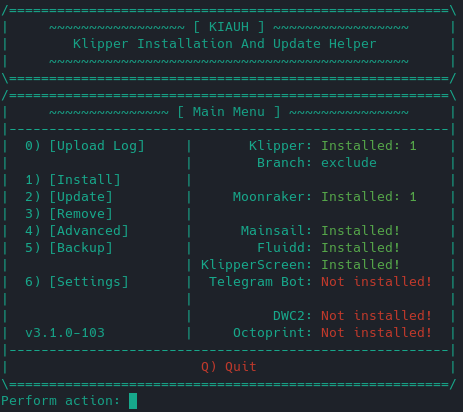

# Installation

## First steps

Install the screen, following the instructions provided by the manufacturer, Some screens don't neeed extra software but some need to be installed with a script.
It's strongly recommended to test it and ensure your hardware is working with RaspberryOS, Ubuntu or any distro you like.
Once you have established that the screen is working, then proceed installing KlipperScreen.

## Setup
The installation process is meant for a non-desktop version of the OS for example RaspberryOS Lite, but it should work on other debian derivatives.

[Click to learn how to check if you installed a desktop version](FAQ.md#how-to-check-if-you-have-a-desktop-environment)

If you installed a desktop (GUI version) of the OS and want to run KlipperScreen exclusively then do:
```sh title="Boot to console / KlipperScreen"
sudo systemctl set-default multi-user.target && sudo reboot
```
to undo and go back to the desktop environment:
```sh title="Boot to the desktop"
sudo systemctl set-default graphical.target && sudo reboot
```

## Auto install

[KIAUH](https://github.com/th33xitus/kiauh) is a tool that helps you install or upgrade Klipper, Moonraker, Mainsail, and other extensions.



You can visit [KIAUH on GitHub](https://github.com/th33xitus/kiauh) to learn more and view its documentation.


## Manual Install

First install [Klipper](https://www.klipper3d.org/Installation.html) and [Moonraker](https://moonraker.readthedocs.io/en/latest/installation/).

### KlipperScreen Installation
Execute the following commands:

```sh
cd ~/
git clone https://github.com/KlipperScreen/KlipperScreen.git
cd ~/KlipperScreen
./scripts/KlipperScreen-install.sh
```

This script will install packages that are listed under manual install, create a python virtual environment at
`~/.KlipperScreen-env` and install a systemd service file.

If you need a custom location for the configuration file, you can add -c or --configfile to the systemd file and specify
the location of your configuration file.

At this point KlipperScreen should be working, if it doesn't start then go to the [troubleshooting page](Troubleshooting.md)
!!! warning

## Moonraker configuration

In moonraker.conf ensure that the IP of the device is a trusted client:

```ini title="moonraker.conf"
[authorization]
trusted_clients:
  127.0.0.1
```
!!! warning
    having `force_logins: true` in this section or if you don't want to use `trusted_clients`

    Will require the [moonraker api key](https://moonraker.readthedocs.io/en/latest/installation/#retrieving-the-api-key) in [KlipperScreen.conf](Configuration.md)

If you wish to use the update manager feature of moonraker for KlipperScreen, add the following block to `moonraker.conf`:

```ini title="moonraker.conf"
[update_manager KlipperScreen]
type: git_repo
path: ~/KlipperScreen
origin: https://github.com/ShohninDmitriy/KlipperScreen.git
virtualenv: ~/.KlipperScreen-env
requirements: scripts/KlipperScreen-requirements.txt
system_dependencies: scripts/system-dependencies.json
managed_services: KlipperScreen
```
!!! tip
    If you see warnings in other UIs ignore them until KlipperScreen finishes installing, and Moonraker is restarted.


## Printer Configuration

Some basic configuration needs to be applied for correct functionality.

```ini title="printer.cfg"
[virtual_sdcard]
path: ~/printer_data/gcodes
[display_status]
[pause_resume]
```

## Macros

You may need some macros for the printer to function as you expected, [read more in the macros page](macros.md)
